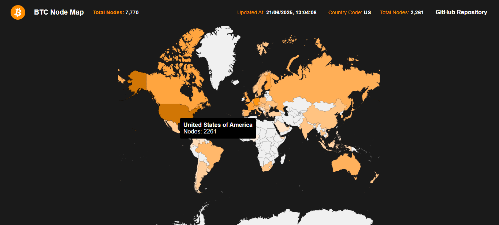

# 🗺️ BTC Node Map

Um mapa-múndi interativo que visualiza a cada 30 minutos a distribuição de nós (nodes) acessíveis da rede Bitcoin por país, utilizando dados da API da Bitnodes.



---

## ✨ Funcionalidades

* **Mapa Interativo:** Visualize a concentração de nodes Bitcoin globalmente.
* **Gradiente de Cores Temático:** Países com mais nodes são destacados com um gradiente de cor laranja, inspirado na identidade visual do Bitcoin.
* **Dados em Tempo Real:** As informações são atualizadas periodicamente para refletir o estado atual da rede (30min).
* **Interface Informativa:**
    * Passe o mouse sobre um país para ver o código e o número de nodes.
    * A barra de navegação exibe o número total de nodes da rede e o horário da última atualização.
    * O mapa permite zoom e pan (arrastar) para uma exploração detalhada.
* **Containerizado com Docker:** Setup simplificado para rodar todo o ambiente (Frontend, Backend e Banco de Dados) com um único comando.

---

## 🛠️ Tecnologias Utilizadas

O projeto é dividido em duas partes principais: o backend que processa e armazena os dados, e o frontend que os exibe.

### Backend

* **Java 17:** Versão moderna e robusta da plataforma Java.
* **Spring Boot (Spring Web):** Framework para criar aplicações web e APIs RESTful de forma rápida e eficiente.
* **Redis:** Banco de dados em memória, utilizado como cache para armazenar os dados dos nodes e diminuir a carga na API externa.
* **OpenFeign:** Cliente HTTP declarativo para consumir a API da Bitnodes de forma simples.
* **Lombok:** Biblioteca para reduzir código boilerplate (getters, setters, construtores, etc.) nas classes Java.

### Frontend

* **React:** Biblioteca para construir interfaces de usuário dinâmicas e reativas.
* **TypeScript:** Superset do JavaScript que adiciona tipagem estática, aumentando a robustez e a manutenibilidade do código.
* **React Simple Maps:** Biblioteca para a criação de mapas customizáveis e interativos em React.

---

## 🐳 Rodando o Projeto com Docker

Para executar a aplicação, você precisa ter o **Docker** e o **Docker Compose** instalados em sua máquina.

### Passos para a Execução

1.  **Clone o Repositório**

    ```bash
    git clone [https://github.com/luizsolely/btc-node-map.git](https://github.com/luizsolely/btc-node-map.git)
    cd seu-repositorio
    ```

2.  **Estrutura de Pastas**

    Certifique-se de que seu projeto segue a estrutura de pastas esperada pelos arquivos Docker:

    ```
    /
    ├── backend/
    │   ├── src/
    │   ├── pom.xml
    │   └── Dockerfile
    ├── frontend/
    │   ├── src/
    │   ├── package.json
    │   └── Dockerfile
    └── docker-compose.yml
    ```

3.  **Suba os Containers**

    Na raiz do projeto (onde o arquivo `docker-compose.yml` está localizado), execute o seguinte comando. Ele irá construir as imagens do backend e do frontend e iniciar os três serviços (Redis, Backend, Frontend).

    ```bash
    docker-compose up -d --build
    ```
    * `up`: Cria e inicia os containers.
    * `-d`: Modo "detached" (os containers rodam em segundo plano).
    * `--build`: Força a construção das imagens a partir dos Dockerfiles.

4.  **Acesse a Aplicação**

    Após os containers iniciarem (pode levar um minuto para o backend se conectar ao Redis e estar pronto), abra seu navegador e acesse:

    ➡️ **http://localhost:3000**

5.  **Para Parar a Aplicação**

    Para parar todos os containers, execute o seguinte comando no mesmo diretório:

    ```bash
    docker-compose down
    ```

---

## 📄 Arquivos de Containerização

### Backend Dockerfile (`backend/Dockerfile`)
```dockerfile
# Estágio de Build
FROM maven:3.9.6-eclipse-temurin-17 AS build
WORKDIR /app
COPY pom.xml .
COPY src ./src
RUN mvn clean package -DskipTests

# Estágio de Execução
FROM eclipse-temurin:17-jdk
WORKDIR /app
COPY --from=build /app/target/*.jar app.jar
ENTRYPOINT ["java", "-jar", "app.jar"]
```

### Frontend Dockerfile (`frontend/Dockerfile`)
```dockerfile
# Estágio de Build
FROM node:20 AS build
WORKDIR /app

COPY package*.json ./
RUN npm install

COPY . .
RUN npm run build

# Estágio de Produção
FROM nginx:alpine
COPY --from=build /app/dist /usr/share/nginx/html
EXPOSE 80
CMD ["nginx", "-g", "daemon off;"]
```

### Docker Compose (`docker-compose.yml`)
```yaml
version: '3.8'

services:
  redis:
    image: redis:7
    container_name: redis
    ports:
      - "6379:6379"
    volumes:
      - redis_data:/data
    restart: unless-stopped

  backend:
    build:
      context: ./backend
      dockerfile: Dockerfile
    container_name: btc-backend
    ports:
      - "8080:8080"
    environment:
      SPRING_DATA_REDIS_HOST: redis
      SPRING_DATA_REDIS_PORT: 6379
    depends_on:
      - redis
    restart: unless-stopped

  frontend:
    build:
      context: ./frontend
      dockerfile: Dockerfile
    container_name: btc-frontend
    ports:
      - "3000:80"
    depends_on:
      - backend
    restart: unless-stopped

volumes:
  redis_data:
```

---

## ✒️ Autor

* **[Luiz Felipe](https://github.com/luizsolely)**

---

## 📜 Licença

Este projeto está sob a licença MIT.
